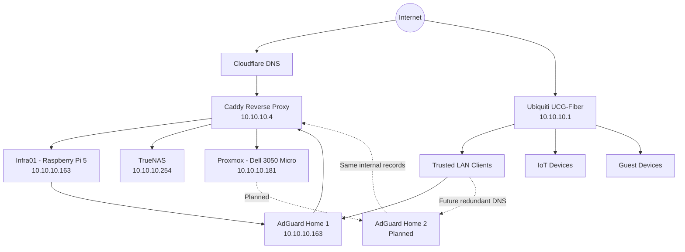
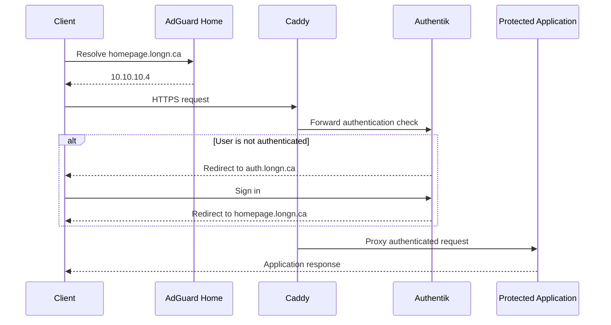
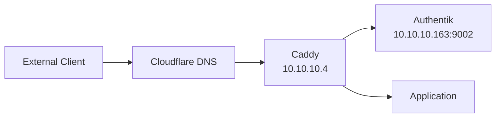
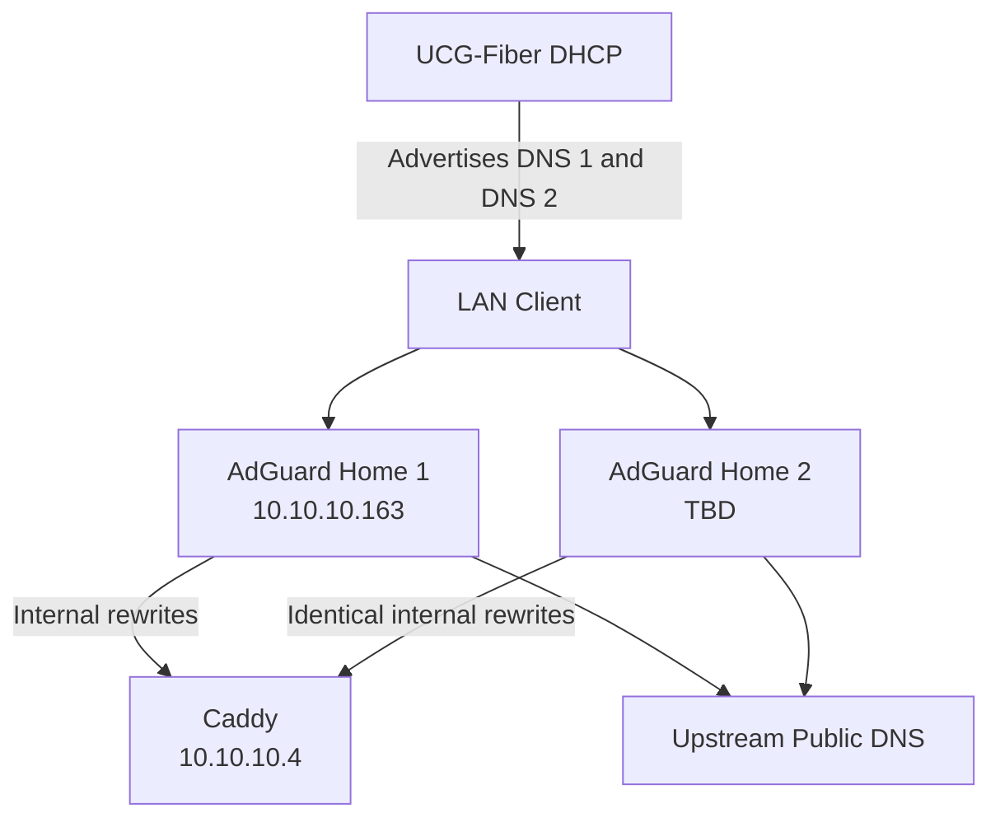
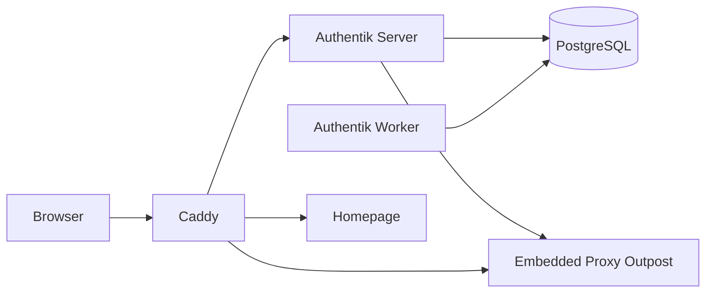
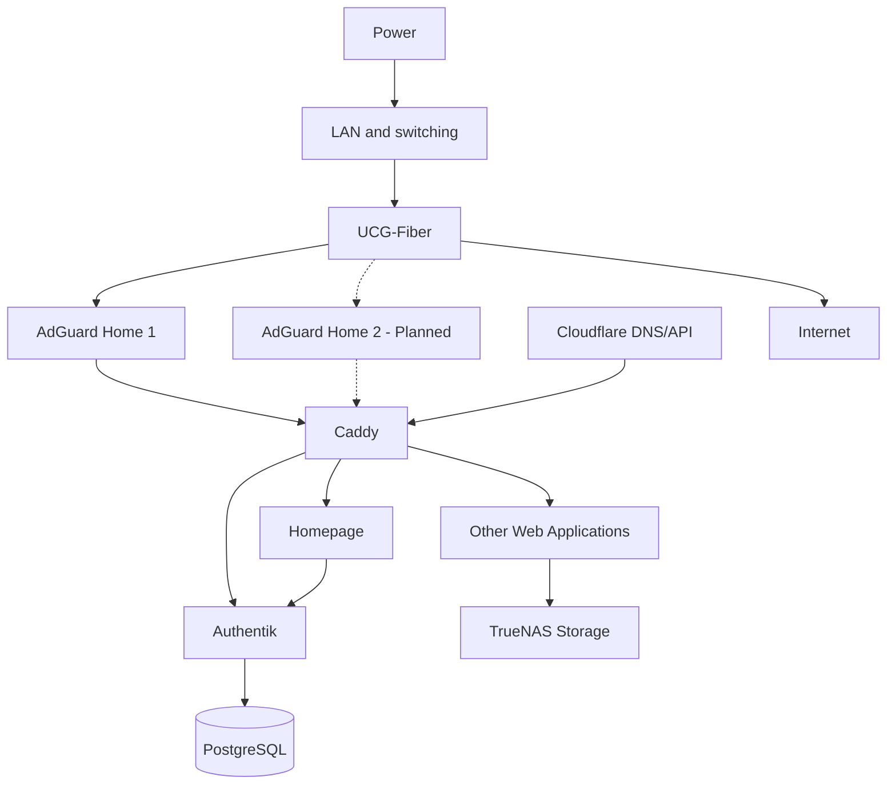

# Homelab Architecture

> Living architecture and recovery document for the `longn.ca` homelab.

## Document Status

| Field | Value |
|---|---|
| Environment | Production homelab |
| Primary domain | `longn.ca` |
| Primary LAN | `10.10.10.0/24` |
| Gateway | `10.10.10.1` |
| Reverse proxy | Caddy |
| Identity provider | Authentik |
| Primary hypervisor | Proxmox VE |
| Primary storage | TrueNAS |
| Last updated | 2026-07-31 |
| Document owner | Long |

---

# 1. Architecture Goals

The homelab is designed around the following principles:

- Use consistent FQDNs internally and externally.
- Terminate HTTPS centrally through Caddy.
- Use valid public certificates for internal and external access.
- Centralize supported web authentication through Authentik.
- Segment infrastructure, servers, clients, IoT, and guests.
- Avoid exposing administrative interfaces unnecessarily.
- Prioritize resilience for foundational services such as DNS.
- Store persistent application data separately from containers.
- Keep configuration documented and version-controlled.
- Build services so individual components can be restored independently.

---

# 2. Current Network Architecture



## Request Flow: Internal Client



## Request Flow: External Client



---

# 3. IP Address Allocations

## Core Infrastructure

| Address | Hostname | Device or service | Role | Status |
|---|---|---|---|---|
| `10.10.10.1` | `TBD` | Ubiquiti UCG-Fiber | Gateway, routing, DHCP, firewall | Active |
| `10.10.10.4` | `caddy` | Caddy host | HTTPS reverse proxy | Active |
| `10.10.10.163` | `Infra01` | Raspberry Pi 5 | Infrastructure Docker host | Active |
| `10.10.10.181` | `pve-3050` | Dell 3050 Micro | Proxmox VE node | Active |
| `10.10.10.254` | `TBD` | TrueNAS | Storage and application workloads | Active |
| `TBD` | `adguard02` | Proxmox LXC | Secondary AdGuard Home | Planned |

## Network Equipment

| Address | Device | Role | Notes |
|---|---|---|---|
| `10.10.10.1` | UCG-Fiber | Router, firewall and DHCP | XGS-PON/PPPoE Internet edge |
| `TBD` | U6-Pro | Basement wireless access point | Active |
| `TBD` | U7-Pro | Second-floor wireless access point | Active |
| `TBD` | Flex 2.5G PoE+ | Access switch | Active |
| `TBD` | Xiaomi 10 GbE SFP+ switch | High-speed backbone | Active/planned expansion |

## DHCP

| Setting | Value |
|---|---|
| LAN network | `10.10.10.0/24` |
| Gateway | `10.10.10.1` |
| DHCP pool | `10.10.10.100-10.10.10.254` |
| Current DHCP DNS | UCG-Fiber / `10.10.10.1` |
| Planned DNS 1 | AdGuard Home 1 / `10.10.10.163` |
| Planned DNS 2 | AdGuard Home 2 / `TBD` |

> Reserve infrastructure addresses outside the normal dynamic client range where practical. Update the DHCP pool or reservation strategy if static infrastructure addresses overlap the current pool.

---

# 4. VLAN Architecture

| VLAN | Name | Subnet | Gateway | Purpose | Status |
|---:|---|---|---|---|---|
| Native / `TBD` | Trusted LAN | `10.10.10.0/24` | `10.10.10.1` | Trusted clients and current infrastructure | Active |
| 10 | Infrastructure | `TBD` | `TBD` | Network and core infrastructure | Defined / migration pending |
| 30 | IoT | `TBD` | `TBD` | Smart-home and IoT devices | Active |
| 40 | Guest | `TBD` | `TBD` | Untrusted guest access | Active |
| 50 | Servers | `TBD` | `TBD` | Server and application workloads | Defined / migration pending |

## Wireless Networks

| SSID | VLAN | Security | Purpose |
|---|---:|---|---|
| `GeorgeRingTheBell` | Trusted LAN / `TBD` | WPA3 | Primary trusted wireless |
| `georgeiot` | 30 | 2.4 GHz, PMF disabled | IoT compatibility |
| Guest SSID | 40 | `TBD` | Guest access |

## Intended Inter-VLAN Policy

| Source | Destination | Allowed access |
|---|---|---|
| Trusted LAN | Infrastructure | Administrative access as required |
| Trusted LAN | Servers | Application access |
| IoT | Caddy | TCP 443 only where required |
| IoT | DNS servers | TCP/UDP 53 |
| IoT | Internet | Required outbound traffic |
| IoT | Trusted LAN | Denied by default |
| Guest | Internet | Internet access only |
| Guest | Internal networks | Denied |
| Servers | Databases | Only required application ports |
| Internet | Administrative interfaces | Denied |
| VPN | Administrative interfaces | Allowed for authorized users |

---

# 5. DNS Architecture

## Current State

AdGuard Home runs on `Infra01` and contains internal DNS rewrites for homelab services. The UCG is not yet advertising AdGuard Home as the network-wide DNS server.

As a result, devices using `10.10.10.1` for DNS cannot resolve internal-only records unless those records also exist in public DNS.

## Target State: Redundant DNS



## Internal DNS Records

All internal service FQDNs should resolve to Caddy:

| Record | Internal address | Purpose |
|---|---|---|
| `auth.longn.ca` | `10.10.10.4` | Authentik |
| `homepage.longn.ca` | `10.10.10.4` | Homepage |
| `portainer.longn.ca` | `10.10.10.4` | Portainer |
| `uptime.longn.ca` | `10.10.10.4` | Uptime Kuma |
| `jellyfin.longn.ca` | `10.10.10.4` | Jellyfin |
| `immich.longn.ca` | `10.10.10.4` | Immich |
| `nc.longn.ca` | `10.10.10.4` | Nextcloud |
| `vaultwarden.longn.ca` | `10.10.10.4` | Vaultwarden |

## DNS Resilience Requirements

Both AdGuard Home instances must contain identical:

- Local DNS rewrites
- Upstream resolver settings
- Blocklists
- Allow lists
- Client definitions
- Custom filtering rules
- Bootstrap DNS settings

## DNS Failure Behaviour

| Failure | Expected result |
|---|---|
| Primary AdGuard stops | Clients query secondary AdGuard |
| Secondary AdGuard stops | Clients continue using primary |
| One DNS host is offline | No loss of internal name resolution |
| Both AdGuard instances stop | Internal FQDN resolution fails |
| Caddy stops | DNS resolves, but proxied applications fail |
| Internet stops | Internal DNS and internal services remain available |

> The UCG should not be advertised as a secondary DNS server once split DNS becomes authoritative through AdGuard. Client operating systems may query either advertised DNS server rather than treating the second as a strict standby.

---

# 6. Reverse Proxy Architecture

## Caddy Host

| Field | Value |
|---|---|
| Address | `10.10.10.4` |
| Configuration root | `/etc/caddy` |
| Main configuration | `/etc/caddy/Caddyfile` |
| TLS method | ACME DNS-01 through Cloudflare |
| Environment file | `/etc/caddy/cloudflare.env` |
| Certificate authority | Let’s Encrypt |

## Caddy Directory Structure

```text
/etc/caddy/
├── Caddyfile
├── cloudflare.env
├── snippets/
│   └── cloudflare_tls.caddy
└── sites/
    ├── authentik.caddy
    ├── homepage.caddy
    ├── immich.caddy
    ├── jellyfin.caddy
    ├── nc.caddy
    ├── portainer.caddy
    ├── uptime.caddy
    └── vaultwarden.caddy
```

## Main Caddyfile

```caddy
import /etc/caddy/snippets/*.caddy
import /etc/caddy/sites/*.caddy
```

## Cloudflare TLS Snippet

```caddy
(cloudflare_tls) {
	tls {
		dns cloudflare {env.CLOUDFLARE_API_TOKEN}
		resolvers 1.1.1.1 1.0.0.1
		propagation_delay 10s
		propagation_timeout -1
	}
}
```

> `propagation_timeout -1` was required after local DNS-01 propagation checking timed out even though Cloudflare and Let’s Encrypt could complete validation.

## Caddy Upstream Map

| FQDN | Upstream | Authentication |
|---|---|---|
| `auth.longn.ca` | `10.10.10.163:9002` | Authentik native login |
| `homepage.longn.ca` | `10.10.10.163:3000` | Authentik forward auth |
| `portainer.longn.ca` | `https://10.10.10.163:9443` | Portainer native login; VPN-only planned |
| `uptime.longn.ca` | `10.10.10.163:3001` | Native login |
| `jellyfin.longn.ca` | `10.10.10.254:30013` | Jellyfin native authentication |
| `immich.longn.ca` | `10.10.10.254:30041` | Immich native authentication |
| `nc.longn.ca` | `10.10.10.254:30027` | Nextcloud native authentication |
| `vaultwarden.longn.ca` | `10.10.10.254:30032` | Vaultwarden native authentication |

## Caddy Validation

Manual validation must load the Cloudflare environment file:

```bash
sudo bash -c '
  set -a
  source /etc/caddy/cloudflare.env
  set +a
  caddy validate --config /etc/caddy/Caddyfile
'
```

Reload after successful validation:

```bash
sudo systemctl reload caddy
sudo systemctl status caddy --no-pager
```

Test all services:

```bash
for host in \
  auth.longn.ca \
  homepage.longn.ca \
  portainer.longn.ca \
  uptime.longn.ca \
  jellyfin.longn.ca \
  immich.longn.ca \
  nc.longn.ca \
  vaultwarden.longn.ca
do
  echo
  echo "===== $host ====="
  curl -Ik --max-time 10 "https://$host"
done
```

---

# 7. Identity Architecture

## Authentik Deployment

Authentik runs on `Infra01` through Docker Compose.

| Component | Location |
|---|---|
| Compose directory | `/opt/docker/authentik` |
| Public URL | `https://auth.longn.ca` |
| HTTP host port | `9002` |
| HTTPS host port | `9444` |
| Database | PostgreSQL container |
| Server | Authentik server container |
| Worker | Authentik worker container |
| Redis | Not required by current deployment |

## Authentik Components



## Current Authentik Applications

| Application | Provider | Mode | External URL | Status |
|---|---|---|---|---|
| Homepage | Homepage Proxy | Forward auth, single application | `https://homepage.longn.ca` | Active |

## Embedded Outpost Configuration

The embedded outpost initially detected the internal setup address:

```text
http://10.10.10.163:9002
```

It was corrected to:

```text
https://auth.longn.ca
```

In Authentik `2026.5.6`, the UI did not expose the setting. The concrete model field was `_config`.

Recovery/update procedure:

```bash
cd /opt/docker/authentik
docker compose exec server ak shell
```

```python
from authentik.outposts.models import Outpost

outpost = Outpost.objects.get(
    pk="94b763d1-f99a-442e-9285-b7a3ea960cdc"
)

config = outpost._config.copy()
config["authentik_host"] = "https://auth.longn.ca"
outpost._config = config
outpost.save(update_fields=["_config"])

outpost.refresh_from_db()
outpost._config["authentik_host"]
```

Expected result:

```text
https://auth.longn.ca
```

Restart Authentik if needed:

```bash
docker compose restart server worker
```

## Authentication Classification

### Public with Native Authentication

These applications require direct API, mobile-client, synchronization, or media-client compatibility:

- Jellyfin
- Immich
- Nextcloud
- Vaultwarden

### Authentik Protected

- Homepage
- Grafana — planned
- Paperless-ngx — planned
- Jellyseerr — planned
- Stirling PDF — planned
- Other browser-based dashboards — future

### VPN Only

- Proxmox
- TrueNAS administration
- Portainer
- UniFi administration
- AdGuard Home administration
- SSH
- Wazuh administration
- Caddy administration

---

# 8. Core Hosts

## Infra01 — Raspberry Pi 5

| Field | Value |
|---|---|
| Hostname | `Infra01` |
| Address | `10.10.10.163` |
| OS | Debian 13 |
| Memory | 8 GB |
| Primary role | Core infrastructure services |
| Docker network | `homelab` |
| Compose root | `/opt/docker` |

### Current Containers

| Container | Image | Port |
|---|---|---:|
| Homepage | `ghcr.io/gethomepage/homepage:latest` | `3000` |
| Uptime Kuma | `louislam/uptime-kuma:latest` | `3001` |
| Portainer | `portainer/portainer-ce:latest` | `8000`, `9000`, `9443` |
| Authentik server | Authentik official image | `9002 -> 9000` |
| Authentik worker | Authentik official image | Internal |
| PostgreSQL | PostgreSQL | Internal |
| AdGuard Home | `TBD: Docker/LXC/native details` | DNS and web UI |

### Compose Layout

```text
/opt/docker/
├── authentik/
│   ├── compose.yml
│   └── .env
├── homepage/
│   ├── compose.yml
│   ├── config/
│   ├── icons/
│   └── logs/
├── portainer/
│   └── TBD
└── uptime-kuma/
    └── TBD
```

## Proxmox Node — Dell 3050 Micro

| Field | Value |
|---|---|
| Hostname | `pve-3050` |
| Address | `10.10.10.181` |
| Processor | Intel Core i5-6500 |
| Role | Virtualization and infrastructure redundancy |
| Planned workload | Secondary AdGuard Home LXC |

## TrueNAS

| Field | Value |
|---|---|
| Address | `10.10.10.254` |
| Motherboard | ASUS X99-A |
| Processor | Intel Core i7-6800K |
| GPU | NVIDIA GTX 1070 |
| Role | Storage and application workloads |

### Current Applications

- Jellyfin
- Immich
- Nextcloud
- Vaultwarden

### Planned Applications

- Jellyseerr
- Sonarr
- Radarr
- Prowlarr
- Bazarr
- Recyclarr
- Download client
- Immich machine learning / AI acceleration

---

# 9. Service Catalogue

| Service | FQDN | Host | Upstream | Exposure | Authentication | Status |
|---|---|---|---|---|---|---|
| Authentik | `auth.longn.ca` | Infra01 | `10.10.10.163:9002` | Public | Native + MFA planned | Active |
| Homepage | `homepage.longn.ca` | Infra01 | `10.10.10.163:3000` | Public/protected | Authentik | Active |
| Uptime Kuma | `uptime.longn.ca` | Infra01 | `10.10.10.163:3001` | Review required | Native | Active |
| Portainer | `portainer.longn.ca` | Infra01 | `10.10.10.163:9443` | Public currently; VPN-only planned | Native | Active |
| Jellyfin | `jellyfin.longn.ca` | TrueNAS | `10.10.10.254:30013` | Public | Native | Active |
| Immich | `immich.longn.ca` | TrueNAS | `10.10.10.254:30041` | Public | Native | Active |
| Nextcloud | `nc.longn.ca` | TrueNAS | `10.10.10.254:30027` | Public | Native | Active |
| Vaultwarden | `vaultwarden.longn.ca` | TrueNAS | `10.10.10.254:30032` | Public | Native + MFA required | Active |
| AdGuard Home 1 | `TBD` | Infra01 | `10.10.10.163:TBD` | Internal | Native | Active |
| AdGuard Home 2 | `TBD` | Proxmox LXC | `TBD` | Internal | Native | Planned |
| Grafana | `grafana.longn.ca` | TBD | TBD | Authentik protected | Authentik | Planned |
| Prometheus | Internal only | TBD | TBD | Internal | None/service auth | Planned |
| Wazuh | `TBD` | TBD | TBD | VPN only | Native/Authentik | Planned |

---

# 10. Service Dependencies

## Dependency Diagram



## Dependency Matrix

| Service | Depends on | Impact if dependency fails |
|---|---|---|
| Internal FQDN access | AdGuard Home | Internal names do not resolve |
| External FQDN access | Public DNS and Internet | External access fails |
| All proxied applications | Caddy | HTTPS application access fails |
| Homepage authentication | Authentik | Homepage login fails |
| Authentik | PostgreSQL | Authentication and administration fail |
| Authentik | Infra01 | SSO-protected services become unavailable |
| Jellyfin | TrueNAS application runtime and media storage | Streaming fails |
| Immich | TrueNAS application runtime, database and photo storage | Photo access/upload fails |
| Nextcloud | TrueNAS application runtime, database and storage | File access and sync fail |
| Vaultwarden | TrueNAS application runtime and persistent data | Password vault synchronization fails |
| Caddy certificates | Cloudflare API and ACME CA | New issuance/renewal fails |
| Internal service access | UCG/switching/APs | Clients cannot reach services |
| DNS resilience | Both AdGuard instances | DNS survives one host failure |

---

# 11. Application-Specific Notes

## Homepage

Homepage requires allowed hostnames in its Compose configuration:

```yaml
environment:
  HOMEPAGE_ALLOWED_HOSTS: "homepage.longn.ca,10.10.10.163:3000"
```

Compose directory:

```text
/opt/docker/homepage
```

Recreate after environment changes:

```bash
cd /opt/docker/homepage
docker compose config
docker compose up -d --force-recreate
```

## Nextcloud

Nextcloud must trust Caddy and recognize the external HTTPS URL.

Required system configuration:

```text
overwriteprotocol = https
overwritehost = nc.longn.ca
overwrite.cli.url = https://nc.longn.ca
trusted_proxies[0] = 10.10.10.4
```

Example using `occ`:

```bash
php occ config:system:set overwriteprotocol --value=https
php occ config:system:set overwritehost --value=nc.longn.ca
php occ config:system:set overwrite.cli.url --value=https://nc.longn.ca
php occ config:system:set trusted_proxies 0 --value=10.10.10.4
```

Verify:

```bash
php occ config:system:get overwriteprotocol
php occ config:system:get overwritehost
php occ config:system:get overwrite.cli.url
php occ config:system:get trusted_proxies
```

Expected redirect:

```text
location: https://nc.longn.ca/index.php/login
```

Nextcloud session cookies should include the `Secure` flag.

---

# 12. Recovery Procedures

## Recovery Priority

Restore services in this order:

1. Power and switching
2. UCG-Fiber routing and DHCP
3. DNS
4. Caddy
5. Authentik and PostgreSQL
6. Storage
7. Application services
8. Monitoring and dashboards

---

## 12.1 DNS Primary Failure

### Symptoms

- Primary AdGuard does not respond.
- Clients may pause during DNS lookup.
- Secondary DNS should begin answering.

### Recovery

1. Confirm primary DNS is unavailable:

   ```bash
   dig @10.10.10.163 homepage.longn.ca
   ```

2. Test secondary DNS:

   ```bash
   dig @SECONDARY_DNS_IP homepage.longn.ca
   ```

3. Confirm the secondary returns:

   ```text
   10.10.10.4
   ```

4. Check the primary host and service.
5. Restore AdGuard Home.
6. Verify configuration synchronization.

### Emergency Workaround

Temporarily configure clients or DHCP to use the surviving AdGuard instance only.

Do not use the UCG as secondary DNS unless it contains the same internal records.

---

## 12.2 Complete DNS Failure

### Symptoms

- Internal FQDNs do not resolve.
- Applications may remain reachable by IP and port.
- Existing DNS cache entries may work temporarily.

### Recovery

1. Restore at least one AdGuard Home instance.
2. Verify local DNS rewrites.
3. Verify upstream DNS connectivity.
4. Renew client DHCP leases if DNS settings changed.
5. Flush local DNS caches as required.

Linux:

```bash
resolvectl flush-caches
```

Windows:

```powershell
ipconfig /flushdns
```

iOS:

- Toggle Wi-Fi off and on.
- Renew the DHCP lease if needed.

---

## 12.3 Caddy Failure

### Symptoms

- All proxied FQDNs fail.
- Direct upstream applications may remain accessible by IP and port.
- DNS still resolves to `10.10.10.4`.

### Diagnostic Commands

```bash
systemctl status caddy --no-pager
journalctl -u caddy -n 100 --no-pager
```

Validate configuration:

```bash
sudo bash -c '
  set -a
  source /etc/caddy/cloudflare.env
  set +a
  caddy validate --config /etc/caddy/Caddyfile
'
```

### Recovery

1. Restore the last known working Caddy configuration.
2. Validate it.
3. Restart Caddy:

   ```bash
   sudo systemctl restart caddy
   ```

4. Test each FQDN with `curl -Ik`.

### Restore Location

```text
/etc/caddy/Caddyfile.backup-*
```

Future backup target:

```text
TBD: Git repository or centralized configuration backup
```

---

## 12.4 Certificate Issuance Failure

### Symptoms

- TLS handshake errors for a newly added hostname.
- Existing certificates may continue working.
- Caddy logs report DNS-01 propagation or Cloudflare API issues.

### Checks

```bash
journalctl -u caddy -n 100 --no-pager |
  grep -E 'certificate|challenge|cloudflare|error'
```

Confirm token environment file:

```bash
sudo grep -q '^CLOUDFLARE_API_TOKEN=.' /etc/caddy/cloudflare.env \
  && echo "Token present" \
  || echo "Token missing"
```

Confirm DNS-01 challenge if active:

```bash
dig TXT _acme-challenge.example.longn.ca @1.1.1.1
```

### Known Fix

The environment file must be loaded for manual validation.

The Cloudflare TLS snippet currently disables Caddy’s local propagation precheck:

```caddy
propagation_timeout -1
```

---

## 12.5 Authentik Failure

### Symptoms

- `auth.longn.ca` fails.
- Authentik-protected services cannot complete login.
- Public applications using native authentication may remain available.

### Checks

```bash
cd /opt/docker/authentik
docker compose ps
docker compose logs --tail=100 server worker postgresql
```

### Recovery

```bash
docker compose restart server worker
```

If PostgreSQL is unhealthy:

```bash
docker compose restart postgresql
docker compose restart server worker
```

### Break-Glass Access

Maintain:

- A dedicated Authentik administrator account
- Offline recovery codes
- Native administrator accounts on protected applications where possible
- Direct LAN access to upstream applications for emergency troubleshooting

### Embedded Outpost Incorrect URL

Expected:

```text
https://auth.longn.ca
```

Inspect or repair using the Authentik shell as documented in the Identity Architecture section.

---

## 12.6 Homepage Failure

### Checks

```bash
cd /opt/docker/homepage
docker compose ps
docker compose logs --tail=100
```

Verify allowed host configuration:

```bash
docker inspect homepage \
  --format '{{range .Config.Env}}{{println .}}{{end}}' |
  grep HOMEPAGE_ALLOWED_HOSTS
```

Test directly:

```bash
curl -I \
  -H "Host: homepage.longn.ca" \
  http://10.10.10.163:3000
```

Recreate:

```bash
docker compose up -d --force-recreate
```

---

## 12.7 Nextcloud HTTPS Redirect Failure

### Symptom

Nextcloud redirects to:

```text
http://nc.longn.ca/index.php/login
```

instead of HTTPS.

### Recovery

Reapply:

```bash
php occ config:system:set overwriteprotocol --value=https
php occ config:system:set overwritehost --value=nc.longn.ca
php occ config:system:set overwrite.cli.url --value=https://nc.longn.ca
php occ config:system:set trusted_proxies 0 --value=10.10.10.4
```

Verify:

```bash
curl -Ik https://nc.longn.ca
```

Expected:

```text
location: https://nc.longn.ca/index.php/login
```

---

## 12.8 Infra01 Failure

### Services affected

- Primary AdGuard Home
- Homepage
- Uptime Kuma
- Portainer
- Authentik
- Authentik PostgreSQL

### Expected continuity after DNS HA

- Secondary AdGuard continues answering DNS.
- TrueNAS applications remain available if they do not require Authentik.
- Homepage and Authentik-protected applications may be unavailable.
- Jellyfin, Immich, Nextcloud, and Vaultwarden continue using native authentication if Caddy and DNS remain operational.

### Recovery

1. Restore power and network connectivity.
2. Confirm the Pi boots.
3. Confirm Docker starts.
4. Check all Compose projects.
5. Restore Authentik database if required.
6. Confirm the primary AdGuard configuration matches secondary.
7. Confirm Caddy can reach all Pi-hosted upstream ports.

---

## 12.9 TrueNAS Failure

### Services affected

- Jellyfin
- Immich
- Nextcloud
- Vaultwarden
- Stored media and application data

### Recovery

1. Restore TrueNAS host operation.
2. Verify storage pools.
3. Verify datasets.
4. Verify application containers.
5. Confirm Caddy can reach each upstream.
6. Validate application databases before accepting writes.
7. Run application-specific integrity checks where supported.

---

# 13. Backup Requirements

## Configuration Backups

| Component | Data to back up | Destination | Frequency |
|---|---|---|---|
| Caddy | `/etc/caddy` excluding exposed secrets | Git + secure backup | After changes |
| Caddy token | `/etc/caddy/cloudflare.env` | Encrypted secrets backup | After rotation |
| Authentik | Compose, `.env`, PostgreSQL dump | TrueNAS + off-host | Daily |
| Homepage | Compose and `/opt/docker/homepage/config` | Git/TrueNAS | After changes |
| AdGuard Home | Configuration, rewrites and filters | Secondary node + Git/export | After changes |
| Uptime Kuma | Persistent data | TrueNAS | Daily |
| Portainer | Persistent data | TrueNAS | Daily |
| Nextcloud | Database, config and user data | TrueNAS replication/off-host | Daily |
| Vaultwarden | Database, attachments and config | Encrypted off-host backup | Daily |
| Immich | Database and photo library | TrueNAS replication/off-host | Daily |
| Jellyfin | Configuration and metadata | TrueNAS | Daily/weekly |
| Proxmox | LXC/VM backups | TrueNAS | Scheduled |

## Secret Handling

Never commit these to Git:

- `.env`
- Cloudflare API tokens
- Authentik secret key
- PostgreSQL passwords
- Application API keys
- Vaultwarden secrets
- Recovery codes
- Private keys

Example `.gitignore`:

```gitignore
.env
*.env
*.secret
*.key
*.pem
backups/
secrets/
```

---

# 14. Monitoring Requirements

## Current Monitoring

- Uptime Kuma
- Homepage service dashboard
- UniFi monitoring
- Application-native logs

## Planned Monitoring

- Prometheus
- Grafana
- Node Exporter
- cAdvisor
- Loki
- AdGuard query and health metrics
- Caddy certificate expiration monitoring
- Authentik authentication events
- Proxmox node health
- TrueNAS storage and SMART health
- Internet latency and packet-loss monitoring
- UPS monitoring

## Core Health Checks

| Component | Check |
|---|---|
| UCG-Fiber | ICMP/API |
| AdGuard Home 1 | DNS query + web/API health |
| AdGuard Home 2 | DNS query + web/API health |
| Caddy | HTTPS checks for all FQDNs |
| Authentik | Login endpoint |
| PostgreSQL | Container/database health |
| Homepage | HTTPS endpoint |
| TrueNAS | API/storage pool health |
| Proxmox | API/node status |
| Jellyfin | HTTP/API |
| Immich | HTTP/API |
| Nextcloud | HTTP/status endpoint |
| Vaultwarden | HTTP health endpoint |

---

# 15. Planned Roadmap

## Foundation

- [x] UCG-Fiber routing
- [x] LAN migration to `10.10.10.0/24`
- [x] VLAN definitions
- [x] AdGuard Home primary
- [x] Caddy reverse proxy
- [x] Cloudflare DNS-01 TLS
- [x] Split DNS records
- [x] Modular Caddy configuration
- [x] Authentik deployment
- [x] Homepage protected by Authentik
- [ ] AdGuard Home secondary
- [ ] UCG advertises both AdGuard servers
- [ ] AdGuard configuration synchronization
- [ ] DNS failover test

## Media

- [x] Jellyfin
- [ ] Jellyseerr
- [ ] Sonarr
- [ ] Radarr
- [ ] Prowlarr
- [ ] Bazarr
- [ ] Recyclarr
- [ ] Download client
- [ ] Tautulli or Jellyfin analytics
- [ ] Automated request-to-library workflow

## Photos and AI

- [x] Immich
- [ ] Immich machine-learning service
- [ ] Face recognition
- [ ] Smart search / CLIP
- [ ] Object recognition
- [ ] GPU acceleration
- [ ] GTX 1070 compatibility and passthrough validation

## Monitoring

- [x] Uptime Kuma
- [ ] Prometheus
- [ ] Grafana
- [ ] Loki
- [ ] Node Exporter
- [ ] cAdvisor
- [ ] Central alerting

## Security

- [x] Authentik SSO foundation
- [ ] Authentik MFA
- [ ] Authentik recovery codes
- [ ] Daily-use account separate from admin
- [ ] Portainer moved to VPN-only
- [ ] Proxmox moved to VPN-only
- [ ] TrueNAS administration moved to VPN-only
- [ ] AdGuard administration moved to VPN-only
- [ ] Wazuh
- [ ] CrowdSec
- [ ] Central syslog
- [ ] Automated vulnerability scanning

## Automation and Data

- [ ] Paperless-ngx
- [ ] Stirling PDF
- [ ] n8n
- [ ] Automated backups
- [ ] Restore testing
- [ ] Infrastructure-as-code
- [ ] Configuration deployment automation

---

# 16. Change Management Procedure

For changes to DNS, Caddy, Authentik, or firewall rules:

1. Document the intended change.
2. Back up the current configuration.
3. Change one component at a time.
4. Validate before reloading or restarting.
5. Test internally.
6. Test externally where applicable.
7. Test from a mobile device.
8. Review logs.
9. Update this document.
10. Commit non-secret configuration changes to Git.

Suggested commit patterns:

```text
feat(caddy): add reverse proxy for <service>
feat(authentik): protect <service> with forward auth
feat(dns): add split DNS record for <service>
fix(nextcloud): correct reverse proxy HTTPS handling
docs(architecture): update service inventory
```

---

# 17. Post-Change Test Checklist

- [ ] Internal DNS resolves the service to `10.10.10.4`
- [ ] External DNS resolves as intended
- [ ] TLS certificate is valid
- [ ] HTTP redirects to HTTPS
- [ ] Caddy reaches the upstream
- [ ] Application login works
- [ ] Authentik redirect works where enabled
- [ ] Mobile access works
- [ ] Application clients continue working
- [ ] Logs show no persistent errors
- [ ] Uptime Kuma monitor is updated
- [ ] Homepage entry is updated
- [ ] Documentation is updated
- [ ] Backup scope includes the new service

---

# 18. Open Questions and TBD Items

- [ ] Final VLAN subnet allocations
- [ ] Static-IP reservation strategy
- [ ] Secondary AdGuard address
- [ ] AdGuard synchronization method
- [ ] VPN platform: WireGuard, Teleport, Tailscale, or UniFi VPN
- [ ] Public exposure policy for Uptime Kuma
- [ ] Public exposure removal date for Portainer
- [ ] TrueNAS hostname
- [ ] Access point and switch management addresses
- [ ] Backup destinations and retention periods
- [ ] Off-site backup method
- [ ] UPS design
- [ ] Disaster-recovery test schedule
- [ ] Monitoring and alert notification channels